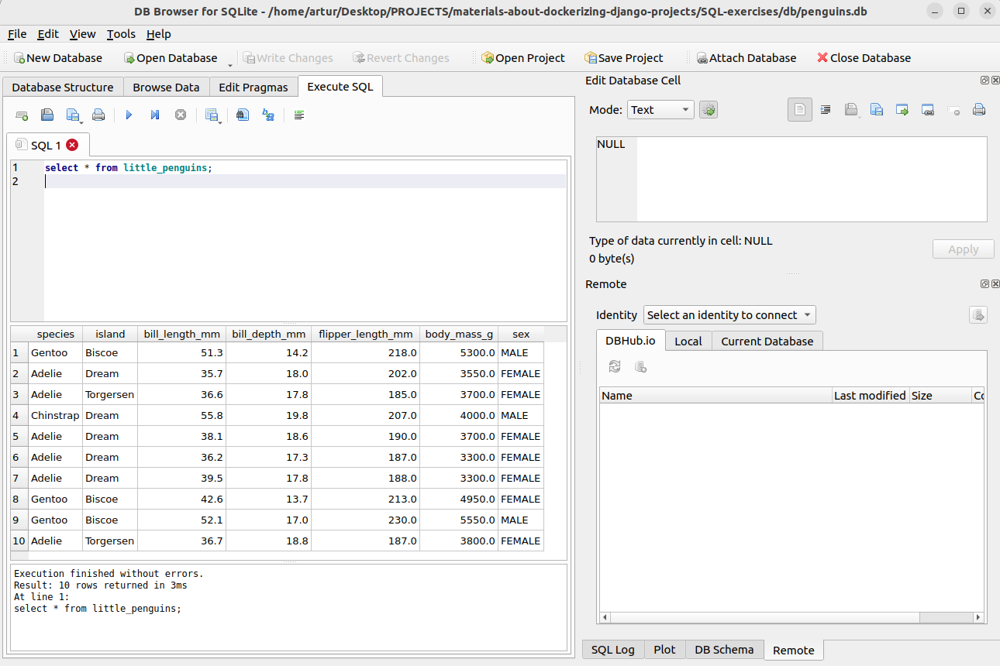

### SQL exercises
1. Pliki zaczynające się od `create` pochodzą z tutoriala [SQLite tutorial](https://www.sqlitetutorial.net/sqlite-python/creating-database/).  
2. Bazy danych do ćwiczeń znajdują się w folderze `db`. Proszę pamiętać o ścieżce do bazy danych w zależności od systemu operacyjnego (`/` lub `\`)!  
3. Zapytania SQL do [tutoriala](https://gvwilson.github.io/sql-tutorial/) znajdują się na [repo autora](https://github.com/gvwilson/sql-tutorial/tree/main/src):  
  - należy je wstawić do pliku `*.py`, przykład zrealizowany jest dla zapytania `select_star.sql` w pliku `select_star.py`,  
  - w ww. plik pokazany jest sposób wyświetlenia wyników zapytania, np. poprzez `fetchone()` lub `fetchall()`,  
  - oczekiwane wyniki zapytań dostępne są na [repo autora](https://github.com/gvwilson/sql-tutorial/tree/main/out),  
  - można wykorzystać narzędzie z linków (DB Browser for SQLite) i wykonać w nim zapytanie:  
    
