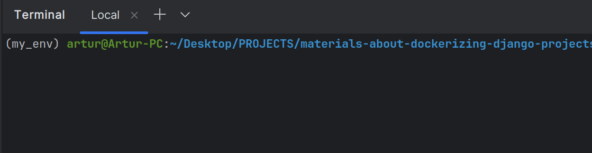

#### Blog w Django

I. Dokumentacja - [Django Girls](https://tutorial.djangogirls.org/pl/)

II. Uwagi  
- każdą czynność zrealizowaną wpisujemy do punktu nr III wraz z użytą komendą, np.  
```bash
python manage.py makemigrations
```
- wymagane konto na [Python Anywhere](https://www.pythonanywhere.com/),  
- proszę o utworzenie nazwy użytkownika na Python Anywhere, takiej jak na Discordzie,  

III. Kolejne kroki
- tworzymy folder roboczy dla naszego projektu, np. `blog-django-by-zacniewski`,  
- utworzenie środowiska wirtualnego, nazwa środowiska powinna zawierać nr albumu lub nick z Discorda:  
```bash
python3 -m venv env_zacniewski
```
- aktywacja środowiska wirtualnego:  
```bash
source env_zacniewski/bin/activate
```
- po aktywacji środowiska wracamy do folderu roboczego, czyli `blog-django-by-zacniewski`
- robimy screenshot z aktywnym środowiskiem wirtualnym i wrzucamy jako obrazek do README, np.  
  

- dodajemy nazwę śrowiska wirtualnego do pliku `.gitignore`:  
```bash
# .gitignore
env_zacniewski/
```
- 