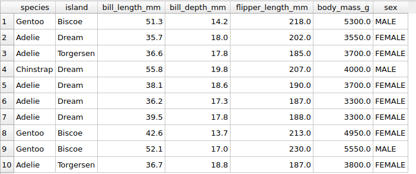

### SQL tutorial

#### 1. Selecting All Values from Table
```bash
select * from little_penguins;
```


#### 2. Specifying Columns
```bash
select
    species,
    island,
    sex
from little_penguins;
```
